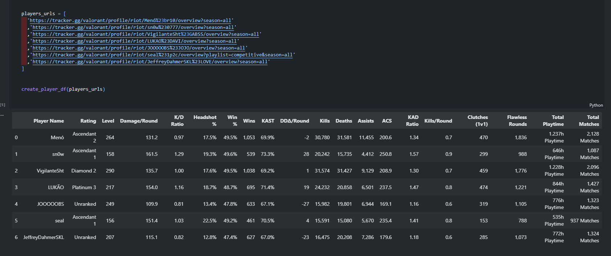

# Valorant Tracker Web Scraper

This project is a tool for extracting Valorant player statistics from [tracker.gg](https://tracker.gg) using Selenium and pandas. The script collects data from multiple players and generates a DataFrame containing detailed information about the players, such as name, total playing time and total number of matches.




## Technologies and Libraries Needed

- [Python](https://www.python.org/) 3.12.4
- [Selenium](https://www.selenium.dev/)
- [Webdriver_manager](https://pypi.org/project/webdriver-manager/)
- [Pandas](https://pandas.pydata.org/)


## Installation

To run this project, you will need to have Python installed on your system. 

1. Clone the repository:

```bash
git clone https://github.com/J0BS013/Valorant-Tracker-Web-Scraper.git
cd Valorant-Tracker-Web-Scraper
```
2. Create and activate a virtual environment:

```bash
python -m venv venv
source venv/bin/activate  
```

3. Install the dependencies:

```bash
pip install -r requirements.txt
```
